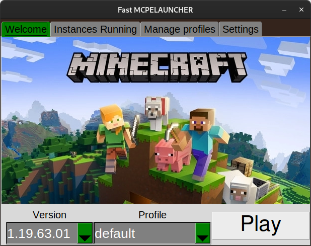

# FastMCPELauncher

A Minecraft Bedrock launcher GUI for linux.

It is an alternative launcher to minecraft-linux/mcpelauncher-ui-qt.

This launcher needs mcpelauncher-client in orders to works.

## Features

- Select your version
- Run multiple instances of the game (with differents accounts)
- Use multiple microsoft accounts without logout

## ToDo

- Manage instance runnings
- Settings
- force to use different profile to run the game
- use a different config folder for each instance
- Google Login to download the game from the store

## Credits

All contributors of minecraft-linux organization (https://github.com/minecraft-linux). This project enables to run android version of Minecraft Bedrock in linux desktop. It allows to have excellent performace in comparison to the Windows version.
